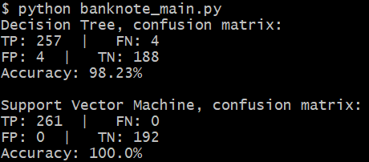
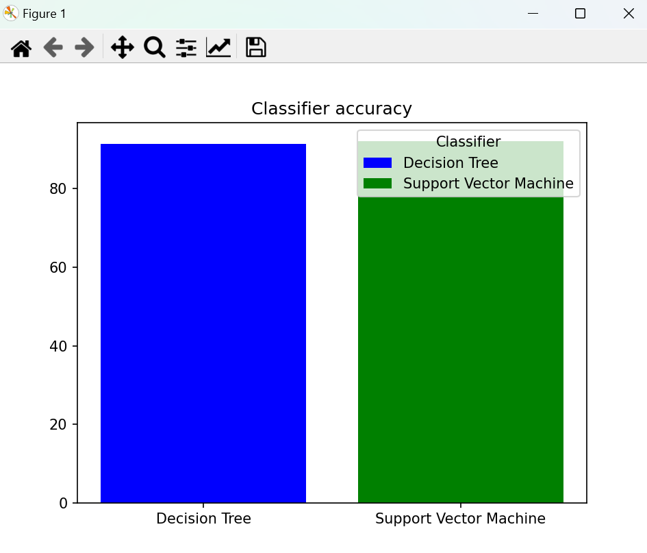
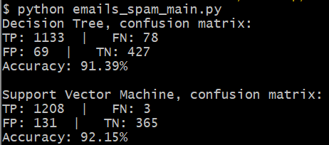

# Classification algorithms
Authors: Michał Siwek, Zuzanna Bernacka

Classification model training and predictions on 2 datasets, banknotes and email spam.<br>
Used classification algorithms are Decision Tree and SVM (Support Vectore Machine)

Code has been developed in PyCharm.

Datasets:

* Banknote Dataset - [link](https://machinelearningmastery.com/standard-machine-learning-datasets/)
* Email Spam Classification Dataset - [link](https://www.kaggle.com/datasets/balaka18/email-spam-classification-dataset-csv)

Used external libraries:

* sklearn - [link](https://scikit-learn.org/stable/)
* matplotlib - [link](https://matplotlib.org)

<h1>Installation and running instructions (for Ubuntu)</h1>

```
apt-get update && apt-get install -y python3 python3-pip
python3 -m pip install scikit-learn matplotlib
python banknote_main.py
*or*
python emails_spam_main.py
```

<h1>Model training results:</h1>
<h3>Banknote authenticity</h3>




<h3>Emails spam</h3>



