# Neural networks

Authors: Zuzanna Bernacka, Michał Siwek

Neural networks training based on TensorFlow library on 4 datasets: banknote authenticity, CIFAR10, Zalando fashion MNIST-like dataset, email spam classification.<br>

Code has been developed in PyCharm and Visual Studio Code.


Datasets:
* banknote authenticity dataset - [link](http://archive.ics.uci.edu/ml/machine-learning-databases/00267/data_banknote_authentication.txt)
* CIFAR10 - [link](https://www.cs.toronto.edu/~kriz/cifar.html)
* Zalando fashion MNIST-like dataset - [link](https://github.com/zalandoresearch/fashion-mnist)
* email spam classification - [link](https://www.kaggle.com/datasets/balaka18/email-spam-classification-dataset-csv)

Used external libraries:
* TensorFlow - [link](https://www.tensorflow.org/install)

<h1>Installation and running instructions (for Ubuntu)</h1>

```
apt-get update && apt-get install -y python3 python3-pip
python -m pip install tensorflow
python banknote.py
*or*
python emails.py
*or*
python animals.py
*or*
python fashion.py
```

<h1>Neural networks training results:</h1>
<h2>Banknote authenticity</h2>

1. Banknote authenticity neural network - 2 layers with 50 neurons, 100 epochs and confusion matrix
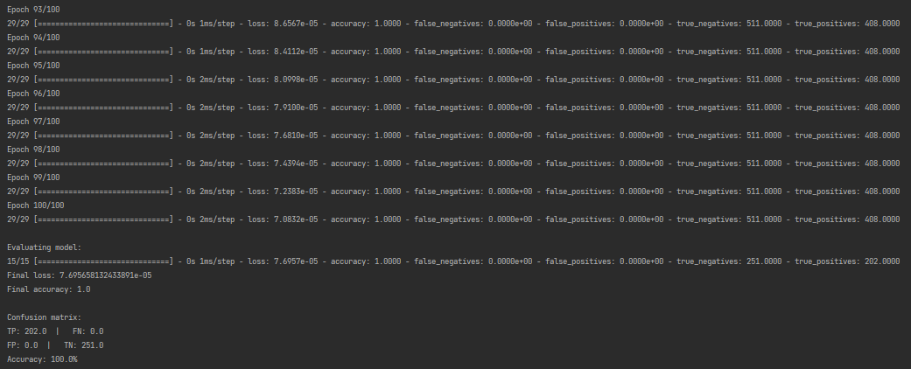
2. Banknote authenticity learning curve - accuracy
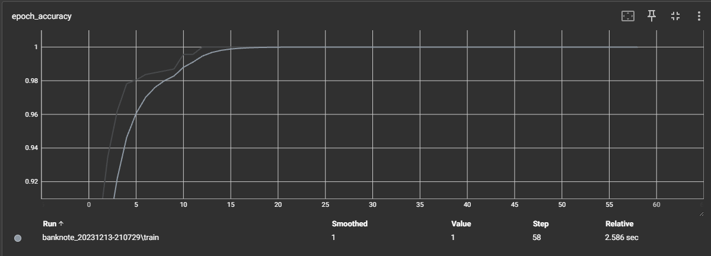
3. Banknote authenticity learning curve - loss
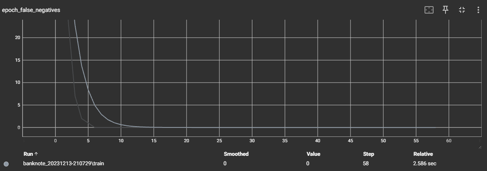
4. Banknote authenticity decision tree and SVM comparison
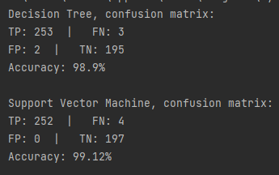

<h2>Zalando clothes recognizing</h2>
<h3> Neural network with 2 layers, 100 neurons and 10 epochs</h3>

1. Zalando clothes recognizing neural network - 2 layers with 100 neurons, 10 epochs
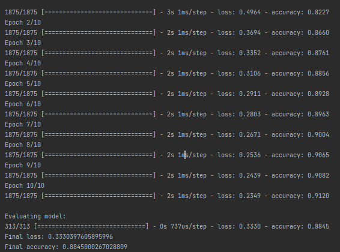
2. Zalando clothes recognizing learning curve - accuracy
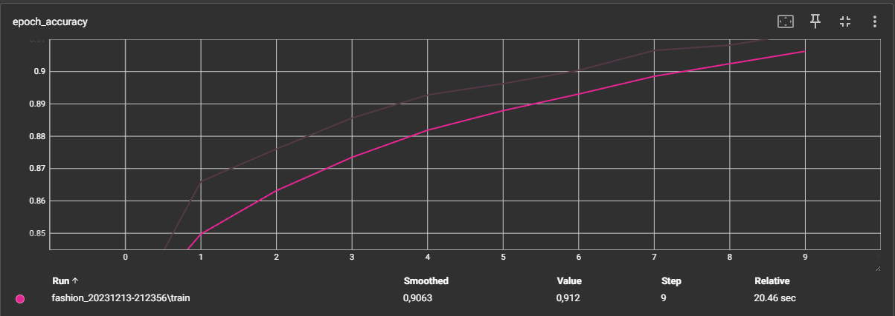
3. Zalando clothes recognizing learning curve - loss
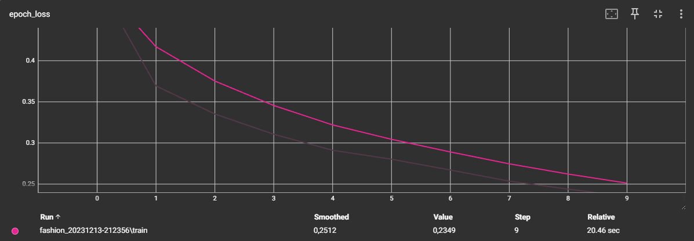

<h3>Neural network with 4 layers, 300 neurons, 10 epochs</h3>

4. Zalando clothes recognizing neural network - 4 layers with 300 neurons, 10 epochs
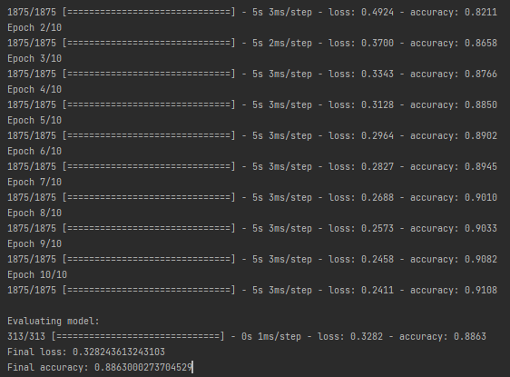
5. Zalando clothes recognizing learning curve - accuracy
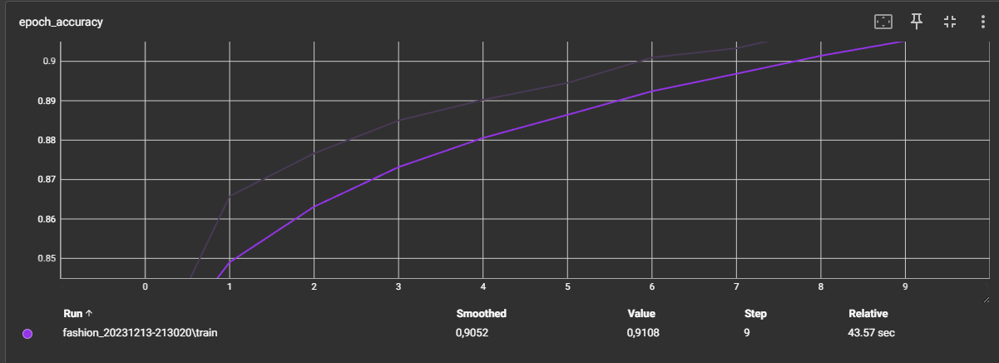
6. Zalando clothes recognizing learning curve - loss
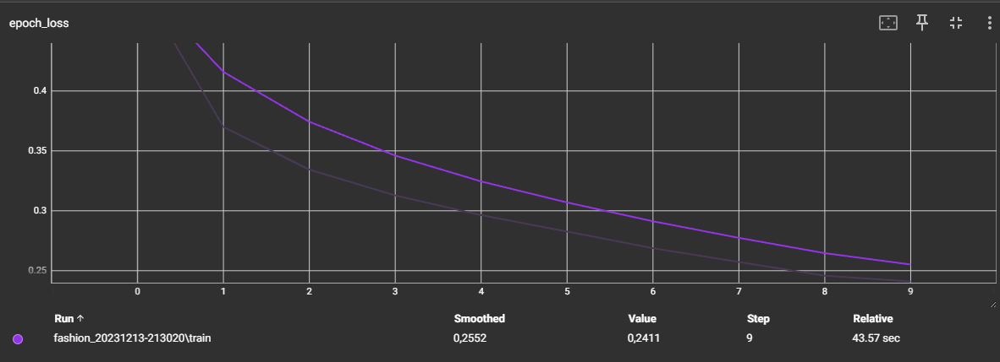
7. Zalando clothes recognizing TensorBoard
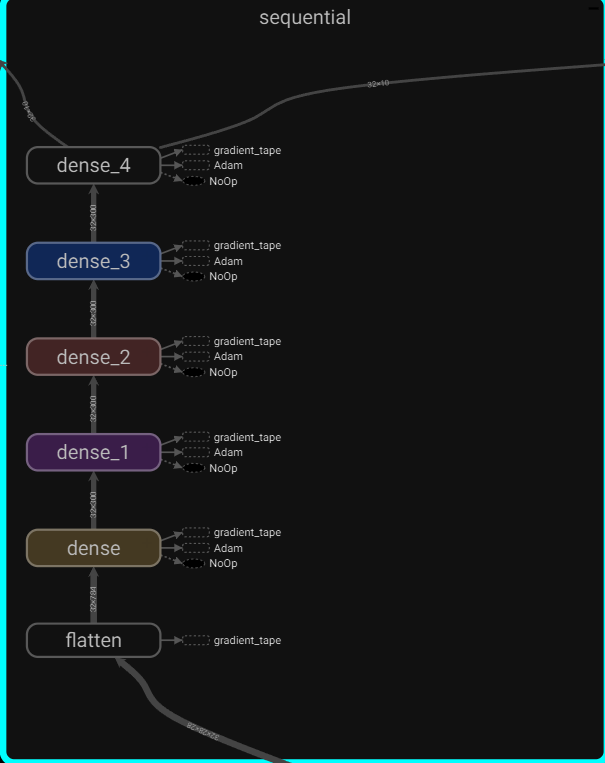

<h3>Neural network with 2 layers, 100 neurons, 50 epochs</h3>

8. Zalando clothes recognizing TensorBoard - 100 neurons, 2 layers
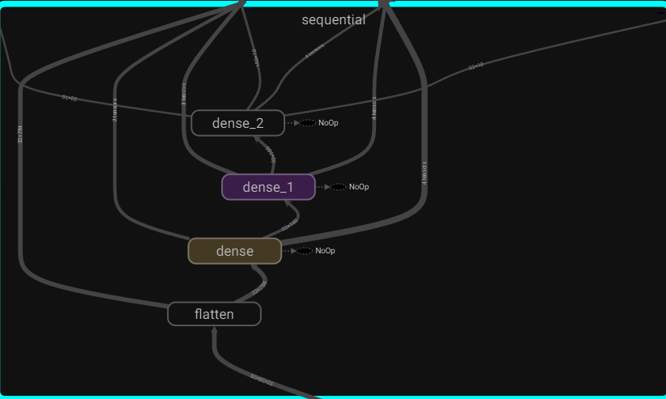
9. Zalando clothes recognizing neural network - 100 neurons, 2 layers
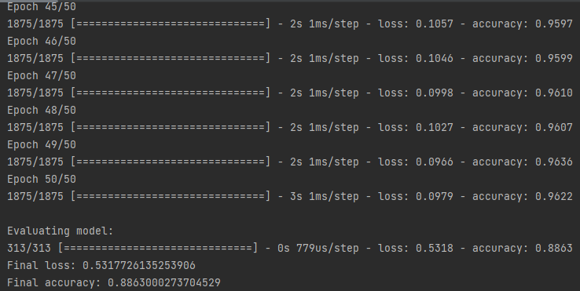
10. Zalando clothes recognizing learning curve - accuracy (100 neurons, 50 epochs)
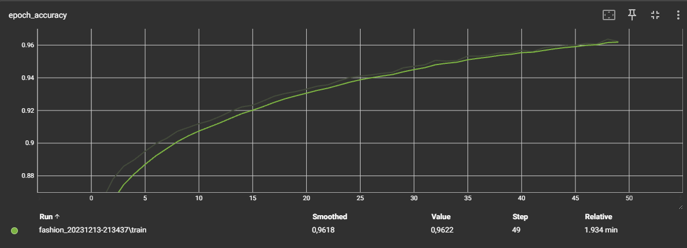
11. Zalando clothes recognizing learning curve - loss (100 neurons, 50 epochs)
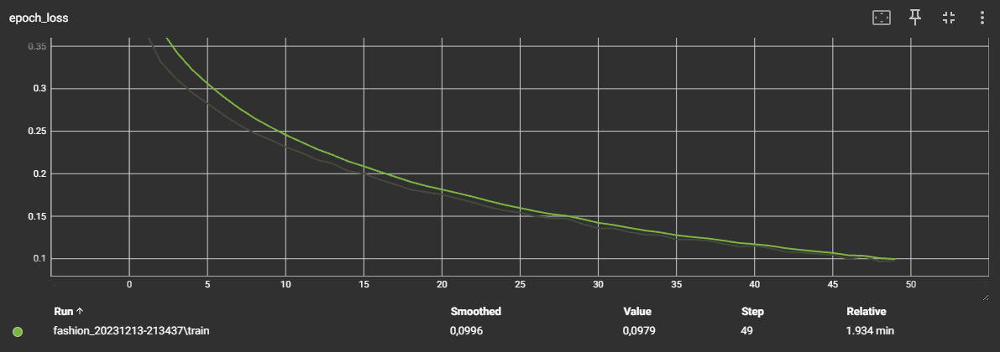

<h3>Neural network with 2 layers, 300 neurons, 10 epochs</h3>

9. Zalando clothes recognizing neural network - 300 neurons, 2 layers, 50 epochs
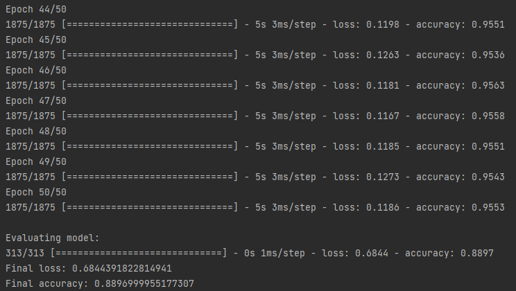
10. Zalando clothes recognizing learning curve - accuracy (300 neurons, 50 epochs)
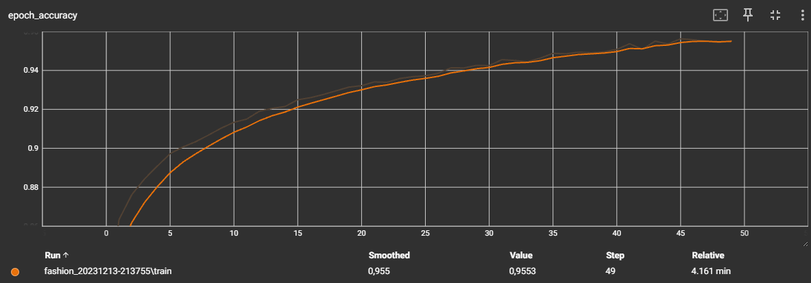
11. Zalando clothes recognizing learning curve - loss (300 neurons, 50 epochs)
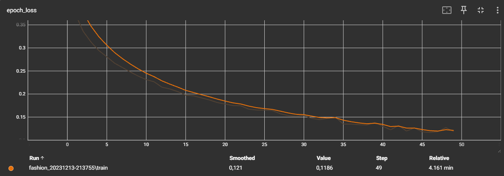