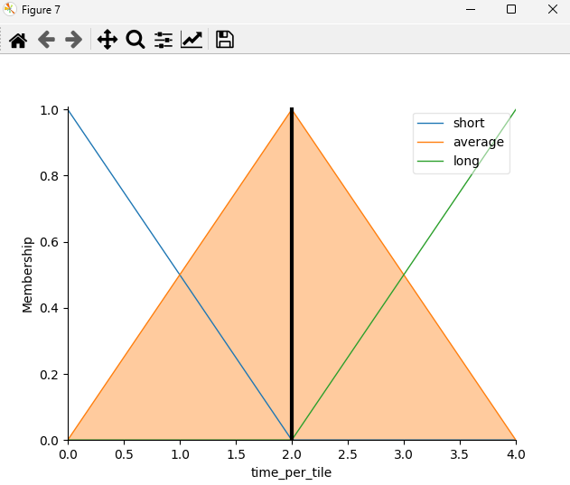
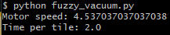
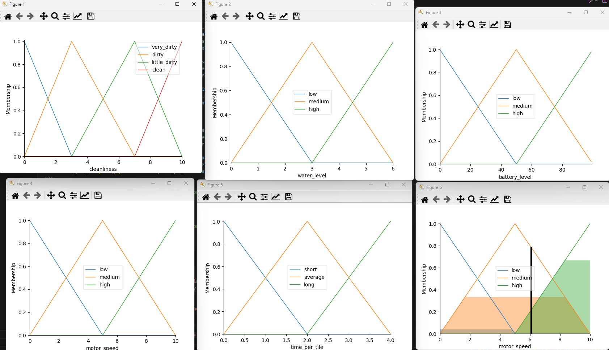
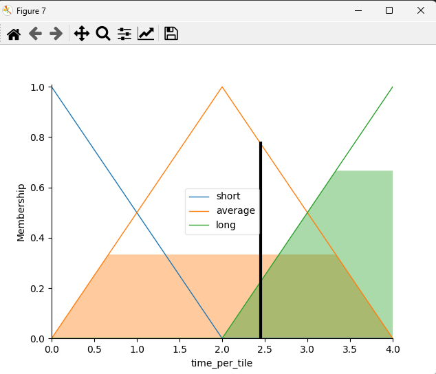
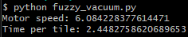

# Roomba vacuum robot logic system
Authors: Michał Siwek, Zuzanna Bernacka

This is roomba vacuum cleaning system, using fuzzy logic.
<br>Code has been developed in PyCharm and Visual Studio Code.

Problem description: We have 3 inputs and after evaluation system presents 2 outputs.
<br>Inputs are as follows:
* cleanliness:
  * Universe (ie, crisp value range): How dirty is a tile on the floor, 
        on a scale of <b>0 to 10?</b>
  * Fuzzy set (ie, fuzzy value range): <b>very dirty, dirty, little dirty, clean</b>
* battery level:
  * Universe: How much battery has the robot left, on a scale of <b>0 to 100?</b>
  * Fuzzy set: <b>low, medium, high</b>
* water level:
  * Universe: What is the water level, on a scale of <b>0 to 6?</b>
  * Fuzzy set: <b>low, medium, high</b>

<br>Outputs are as follows:
* motor speed:
  * Universe: How fast do motors rotate per minute, on a scale of <b>0 to 10</b>
  * Fuzzy set: <b>slow, average, fast</b>
* time per tile:
  * Universe: How much time does a robot spend on one tile, on a scale of <b>0 to 4</b>
  * Fuzzy set: <b>low, medium, high</b>

<h1>Installation and running instructions (for Ubuntu)</h1>

```
apt-get update && apt-get install -y python3 python3-pip
python3 -m pip install numpy matplotlib scikit-fuzzy
python fuzzy_vacuum.py
```

<h1>Execution example</h1>

```
cleanliness_input = 3
water_level_input = 3
battery_level_input = 75
```






```
cleanliness_input = 1
water_level_input = 4
battery_level_input = 98
```






Used external libraries:

* pyplot - [link](https://matplotlib.org/stable/tutorials/pyplot.html)
* numpy - [link](https://numpy.org)
* skfuzzy - [link](https://pythonhosted.org/scikit-fuzzy/user_guide.html)

Sources of help/inspiration:
* tip logic implementation from Microsoft Teams channel
* Fuzzy Auto Guided Vehicle, Fuzzy System sample - [link](http://web.archive.org/web/20190828004759/http://www.aforgenet.com/framework/samples/fuzzy_sets.html)
